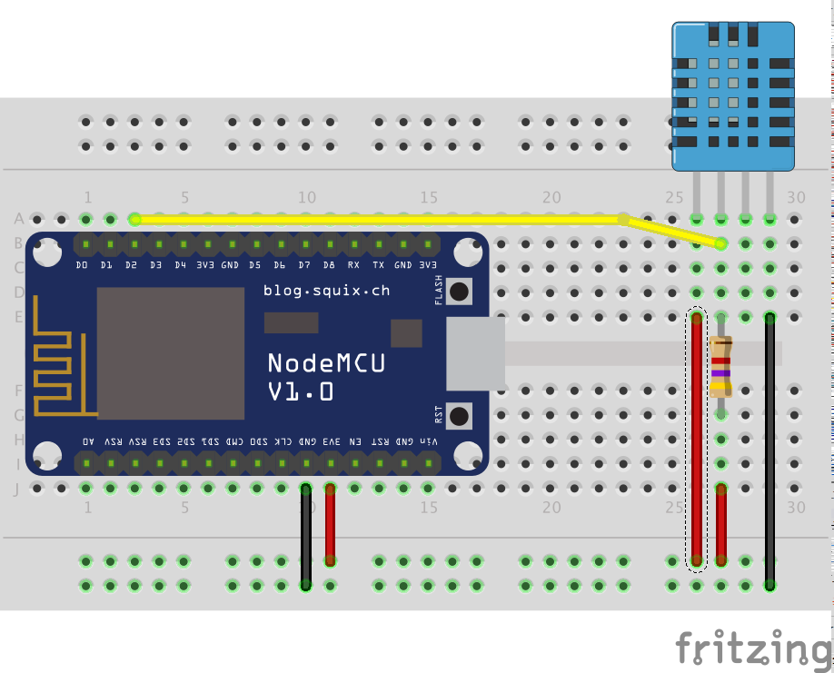
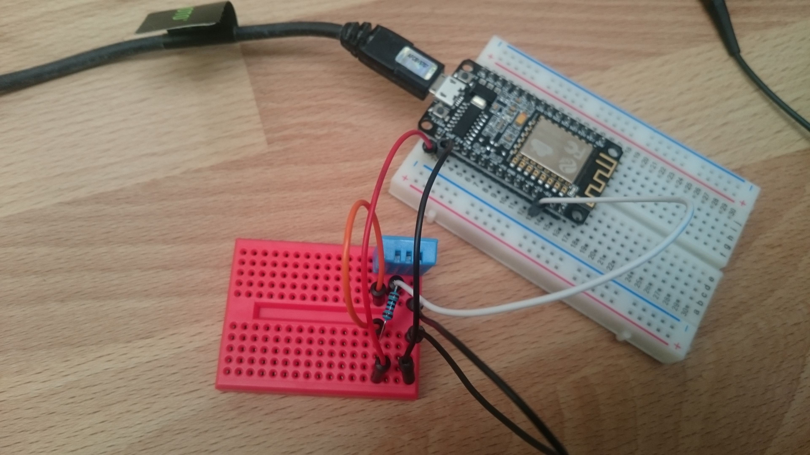

# Envoi des données d'un capteur DHT11 (température/humidité) en UDP/Wifi au format NMEA

Enfin un projet concret, dont l'objectif n'est plus seulement l'apprentissage de la plateforme Arduino !

Ce projet a pour but de créer des petits capteurs autonomes qui communiqueront avec la Raspberry Pi sous [OpenPlotter](http://www.sailoog.com/en/openplotter). Il s'agit d'un ensemble de projets, avec des capteurs météo (température, humidité, pression atmosphérique) pour le journal de bord, un capteur de luminosité pour asservir le feu de mouillage, un compas/gyroscope pour le cap (et pourquoi pas mesurer la gite), et probablement d'autres capteurs qui viendront compléter le dispositif. L'avantage du sans-fil pour ces capteurs est de pouvoir les placer où on le souhaite dans le bateau sans se préoccuper de tirer des câbles dans tous les sens ni de l'atténuation des signaux. Pour le compas qui doit être orienté vers l'avant du bateau, l'intérêt est double, il aurait été délicat de placer le capteur sur la raspberry qui sera amenée à être installée sur un support pivotant (pour orienter l'écran à l'interieur ou l'extérieur du bateau).

Pour le moment, le transport des données se fait en UDP sur une liaison Wifi utilisant le point d'accès offert par OpenPlotter. Le protocole retenu est actuellement NMEA. Il est fort probable qu'avec la sortie de la version 0.9.0, les données soient transmises sur protocole SignalK.

## Part list

* 1 x [NodeMcu 1.0 ESP8266-12F](http://www.banggood.com/Geekcreit-Doit-NodeMcu-Lua-ESP8266-ESP-12E-WIFI-Development-Board-p-985891.html)
* 1 x [DHT11](http://www.banggood.com/2Pcs-DHT11-Digital-Temperature-Humidity-Sensor-Module-For-Arduino-p-948152.html?rmmds=myorder)
* 1 x résistance 4K7Ω

On utilise comme microcontrolleur une NodeMcu, le projet définitif utilisera une [ESP8266-12F](http://www.banggood.com/ESP8266-ESP-12F-Remote-Serial-Port-WIFI-Transceiver-Wireless-Module-p-1007260.html) sans la carte de développement. On aura ainsi un système très compact et très bon marché (de l'ordre de 3€ pour la carte).

Le DHT11 est très bon marché, mais n'est pas très précis ni très réactif et ne permet pas de mesurer des températures négatives. D'autres capteurs existent qui peuvent mieux correspondre à vos besoins. Le DHT11 me va bien pour le moment, je l'utiliserai en nav (plutôt en été) et si les mesures sont approximatives, ça me va très bien.

## Câblage

Le câblage est simplissime, on notera que j'ai placé une [resistance de pull-up](https://learn.sparkfun.com/tutorials/pull-up-resistors), bien que celle ci ne semble pas absolument nécessaire. Certaines sources sur le web en faisait mention. J'ai les mêmes résultats avec ou sans cette résistance.



Hormis cette petite fantaisie, le module DHT11 s'alimente en 3.3v ou 5v sur la pin 1 et 4, le signal est sur la pin2, la 3 n'est pas câblée.

## Code

On utilise la bibliothèque ["DHT11" d'Adafruit](https://github.com/adafruit/DHT-sensor-library) ainsi que deux librairies concernant les fonctionnalités réseau : ESP8266WiFi et WiFiUDP.

### Entête

```
#include <ESP8266WiFi.h>
#include <WiFiUDP.h>
#include <DHT.h>
```

On commence par initialiser le DHT11 : la bibliothèque permet d'utiliser plusieurs types de capteurs de température, on doit préciser lequel on utilise, et sur quelle broche de l'Arduino.

```
#define DHTPIN  D2
#define DHTTYPE DHT11

DHT dht(DHTPIN, DHTTYPE);
```

On poursuit avec l'initialisation du réseau (remplacer ici le ssid, le password, l'adresse ip sur laquelle on envoi nos trames UDP et le port par vos valeurs):

```
const char* ssid = "MON-WIFI";
const char* password = "123password";

const IPAddress remoteIp(192, 168, 1, 255);
const int remotePort = 10112;

WiFiUDP UDP;
```

La machine qui doit recevoir le message est sur un réseau en 192.168.1.x, on utilise ici les fonctionnalités de broadcast en adressant nos messages sur 192.168.1.255 (255 signifie broadcast).

On reviendra ci dessous sur la configuration de la machine OpenPlotter, mais on utilisera un autre port que celui défini par défaut par OpenPlotter.

### Setup

Le setup se contente de démarrer les services utilisés :

```
Serial.begin(9600);
connectWifi();
dht.begin();
```

Serial nous permet d'afficher des messages de debug dans le moniteur série, connectWifi qu'on détaillera ci dessous gère la connection au point d'accès Wifi, et dht prépare le capteur de température à nous livrer ses valeurs.

### La loop

La loop comporte elle plus d'actions : on s'assure que la connection Wifi est toujours ouverte, tente de la rétablir sinon, et une fois la connection établie, on obtient la température, prépare le message NMEA et l'envoie en UDP.

### Connexion au Wifi

La connexion Wifi se fait ainsi (tant qu'après un wifi.begin on n'est pas connecté, on reessaye en se limitant à 10 essais):

```
boolean connectWifi() {
  boolean state = true;
  int i = 0;

  WiFi.begin(ssid, password);

  Serial.println("");
  Serial.print("#WIFI Connecting to ");
  Serial.println(ssid);

  Serial.print("#WIFI Connecting");
  while (WiFi.status() != WL_CONNECTED) {
    delay(500);
    Serial.print(".");
    if (i > 10) {
      state = false;
      break;
    }
    i++;
  }

  if (state) {
    Serial.println("");
    Serial.print("#WIFI Connected to ");
    Serial.println(ssid);
    Serial.print("#WIFI IP address: ");
    Serial.println(WiFi.localIP());
  } else {
    Serial.println("");
    Serial.println("#WIFI Connection failed.");
  }

  return state;
}
```

Pour s'assurer que la connection est active on fait :

```
  if (WiFi.status() == WL_CONNECTED) {
    // ... ici on lit et envoie la température
  } else {
    connectWifi();
  }
```

### Obtention de la température

```
void getTemperature(char *temperature) {

  float t = dht.readTemperature();

  if (isnan(t)) { // Error reading temperature!
    dtostrf(999, 2, 1, temperature);
  }
  else {
    dtostrf(t, 2, 1, temperature);
  }
}
```

Pour des raisons de simplicité d'usage, j'ai retourné ici une chaîne de caractère qui est acceptée par la fonction sprintf (contrairement au float). Ce n'est sans doute pas idéal et sera sans doute revu à l'avenir.

### Construction du message NMEA IIMTA

Le message NMEA qui est reconnu par OpenCPN concernant la température de l'air est le suivant : ```$IIMTA,25.6,C*04``` est se décompose comme suit : ```$``` annonce l'envoi d'une nouvelle phrase NMEA, les valeurs sont ensuite séparées par des virgules, on indique ici que la température est de ```25.6``` degrés, ```C``` comme celcius ; le caractère ```*``` clos la phrase NMEA, et on ajoute au bout un crc destiné à pouvoir valider le message (```04``` dans notre cas). Le crc est construit en faisant un XOR sur tous les caractères compris entre ```$``` et ```*```, ces deux caractères étant exclus.

Il existe d'autres phrases NMEA pour l'envoi des températures (WIXDR, IIMMB) qui sont pourtant recommandées (MTA est déprécié mais plus ancien), mais non reconnues par OpenCPN. Dans une prochaine version du projet, on enverra également ces phrases NMEA.

Anvant de construire cette chaîne de caractères, on récupère la température, comme dit précédemment, on aura d'autres messages à envoyer pour la même donnée et le capteur ne permet pas d'être interogé plus d'une fois par seconde.

Le message est alors construit ainsi à grand coup de sprintf :

```
void sendIIMTA(char *temperature) {

  char nmeaTemplate[17] = "$IIMTA,%s,C*";

  char nmeaSentence[17];
  sprintf(nmeaSentence, nmeaTemplate, temperature);

  byte crc = calcNmeaChecksum(nmeaSentence);

  char nmeaWithCrc[17];
  sprintf(nmeaWithCrc, "%s%02d", nmeaSentence, crc);

  sendUDPPacket(nmeaWithCrc, remoteIp, remotePort);
}
```

Une fois le message construit, il est envoyé en UDP.

### Calcul du CRC

Le CRC est construit comme suit :

```
byte calcNmeaChecksum(char *sentence) {
  byte CRC = 0;
  byte x = 1;
  while (sentence[x] != '*') { // XOR every character in between '$' and '*'
    CRC = CRC ^ sentence[x] ;
    x++;
  }
  return CRC;
}
```

### Envoi de la trame UDP

Une fois expurgée des traces de debug, la fonction est aussi simple que :

```
void sendUDPPacket(const char* packet, IPAddress remoteIp, int remotePort) {

  if (UDP.beginPacket(remoteIp, remotePort)) {
    UDP.write(packet);
  }
}
```

## Paramétrage d'OpenPlotter

TODO : configuration d'OpenPlotter et OpenCPN

## Réalisation

Le montage sur la plaque à essai :



Les données obtenues par OpenCPN


